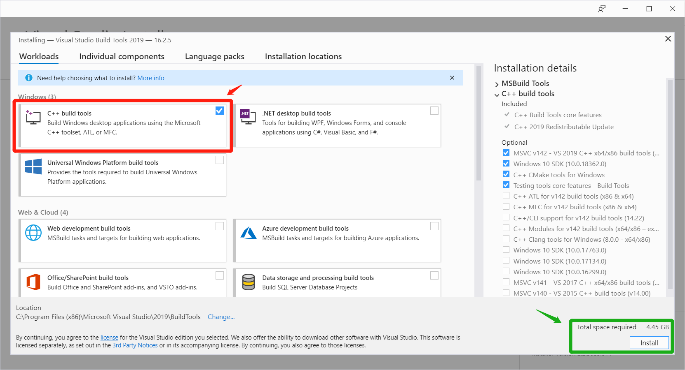
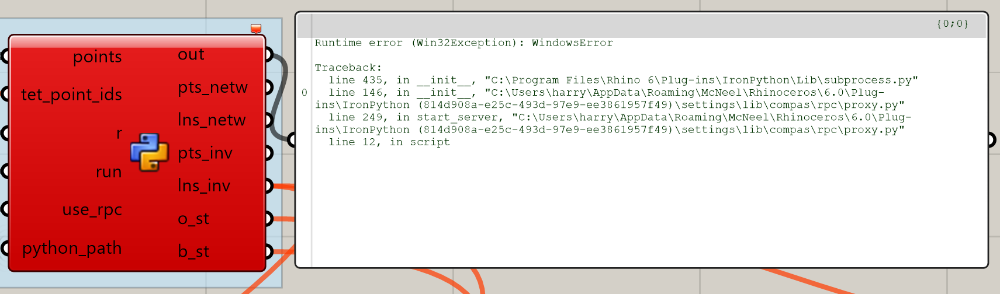
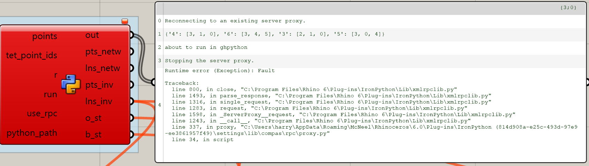

=============
coop_assembly
=============

.. start-badges

.. image:: https://img.shields.io/badge/License-MIT-blue.svg
    :target: https://github.com/stefanaparascho/coop_assembly/blob/master/LICENSE
    :alt: License MIT

.. end-badges

.. Write project description

**coop_assembly**: Geometry generation of robotically assembled spatial structures.

**News:**

    9-21-2019: This package contains materials for the `FABRICATION-INFORMED DESIGN OF 
    ROBOTICALLY ASSEMBLED STRUCTURES <https://design-modelling-symposium.de/workshops/fabrication-informed-design-of-robotically-assembled-structures/>`_
    for the Design Modeling Symposium Berlin 2019.

Installation
------------

.. Write installation instructions here

Prerequisites
^^^^^^^^^^^^^

0. Operating System: **Windows 10**
1. `Rhinoceros 3D 6.0 <https://www.rhino3d.com/>`_
    We will use Rhino / Grasshopper as a frontend for inputting
    geometric and numeric paramters, and use various python packages as the 
    computational backends. The tight integration between Grasshopper and python
    environments is made possible by `COMPAS <https://compas-dev.github.io/>`_ 
    and `COMPAS_FAB <https://gramaziokohler.github.io/compas_fab/latest/>`_.
2. `Git <https://git-scm.com/>`_
    We need ``Git`` for fetching required packages from github.
3. `Miniconda <https://docs.conda.io/en/latest/miniconda.html>`_
    We will install all the required python packages using 
    `Miniconda` (a light version of Anaconda). Miniconda uses 
    **environments** to create isolated spaces for projects' 
    depedencies.
4. `Microsoft Visual Studio Build tools <https://visualstudio.microsoft.com/thank-you-downloading-visual-studio/?sku=BuildTools&rel=16>`_ (see vc14_instruction_ for instructions).
    Our simulation environment ``pybullet`` has a C++ backend, which needs
    ``Microsoft Visual C++ 14.0`` to compile and build the python bindings.

Working in a conda environment
^^^^^^^^^^^^^^^^^^^^^^^^^^^^^^

It is recommended to set up a conda environment to create a clean, isolated space for
installing all the required python packages. We've provided a conda environment file
to make this process easy - please do the following steps:

Type in the following commands in your Anaconda terminal 
(search for ``Anaconda Prompt`` in the Windows search bar):

::

    git clone https://github.com/createchaos/coop_assembly.git
    cd coop_assembly/test_envs
    conda env create -f coop_assembly_ws.yml

Wait for the building process to finish, the command above will
fetch and build all the required packages, which will take some time
(5~10 mins).

If you see an error message like ``Error: Microsoft Visual C++ 14.0 is required``,
please follow vc14_instruction_ to install the Microsoft Visual Studio Build tools.

Then, activate the newly created conda environment (with all the needed packages installed):

::

    conda activate coop_assembly_ws

Great - we are almost there! Now type `python` in your Anaconda Prompt, and test if the installation went well:

::

    >>> import compas
    >>> import compas_fab
    >>> import pybullet
    >>> import coop_assembly
    >>> import ikfast_ur5

If that doesn't fail, you're good to go! Exit the python interpreter (either typing `exit()` or pressing `CTRL+Z` followed by `Enter`).

Now let's make all the installed packages available inside Rhino. Still from the Anaconda Prompt, type the following:

In order to make ``coop_assembly`` accessible in Rhino/Grasshopper,
we need the run the following commands in the Anaconda prompt first 
and then **restart Rhino**:

::

    python -m compas_rhino.install
    python -m compas_rhino.install -p coop_assembly ur_online_control compas_fab roslibpy

And you should be able to see outputs like:

::

   Installing COMPAS packages to Rhino 6.0 IronPython lib:
   IronPython location: C:\Users\<User Name>\AppData\Roaming\McNeel\Rhinoceros\6.0\Plug-ins\IronPython (814d908a-e25c-493d-97e9-ee3861957f49)\settings\lib

   compas               OK
   compas_rhino         OK
   compas_ghpython      OK
   compas_bootstrapper  OK
   coop_assembly        OK

   Completed.

Congrats! 🎉 You are all set! 

Grasshopper examples can be found in ``examples\workshop_dms``.

Troubleshooting 
---------------

Sometimes things don't go as expected. Here are some of answers to the most common issues you might bump into:

------------

..

    Q: Error: Microsoft Visual C++ 14.0 is required

.. _vc14_instruction:

1. Follow the `link <https://visualstudio.microsoft.com/thank-you-downloading-visual-studio/?sku=BuildTools&rel=16>`_ 
   to download the visual studio build tools.
2. Click the ``vs_buildtools__xxx.exe`` file you just downloaded.
3. Follow the instruction of the Visual Studio Installer, until it
   finishes its downloading and installation.
4. Select ``C++ Build Tools`` and click ``Install``.

------------

..

    Q: I've installed ``git`` but ``git`` commands don't work in the commandline prompt.

See `this post <https://stackoverflow.com/a/53706956>`_ for instructions on
how to add ``git`` to the environment PATH in Windows.

------------

..

    Q: `conda` commands don't work.

Try running them from the *Conda Prompt*. Depending on how you installed Anaconda, it might not be available by default on the normal Windows command prompt.

------------

..

    Q: When trying to install the framework in Rhino, it fails indicating the lib folder of IronPython does not exist.

Make sure you have opened Rhino 6 and Grasshopper at least once, so that it finishes setting up all its internal folder structure.

------------

..

    Q: Windows error in the Grasshopper rpc call.

Make sure you enter the correct python path in the GH file. An easy way to obtain
the path is to type ``where python`` in your conda prompt after you activate ``coop_assembly_ws``.

------------

..

    Q: Runtime error: Fault in the Grasshopper rpc call.

Try the following:

1. If you have V-Ray installed, uninstall V-Ray for Rhinoceros and 
   restart your computer.
2. If the problem persists after retrying, first open your Task Manager and
   end all ``Python`` processes.

   Then in your activated conda environment, run:

    ::

        cd docs/gh_example_instructions
        python rpc_test.py

    It should print the following:

    ::

        Starting a new proxy server...
        New proxy server started.

    Then, retry opening the Grasshopper file.

------------

..

    Q: In Xfunc call, error message "Cannot find DLL specified. (_Arpack ...)"

This happens because some previous calls blocked the ``scipy`` complied libraries.
For a temporal fix, in your conda environment, uninstall ``pip install scipy`` and
then ``pip install scipy=1.3.1`` works.

Updating packages
-----------------

Updating the conda environment
^^^^^^^^^^^^^^^^^^^^^^^^^^^^^^

If you've installed the environment following the instructions above,
but want to update the env (e.g. if the ``yml`` file is updated),
run the following command to update:

::

    conda env update -n coop_assembly_ws -f coop_assembly_ws.yml

Updating individual packages
^^^^^^^^^^^^^^^^^^^^^^^^^^^^

Updating only some of the dependencies? Here are some convenient links
(remember to activate your conda environment by ``conda activate coop_assembly_ws`` 
before you do these!):

Update ``coop_assembly``:

::

    pip install git+https://github.com/createchaos/coop_assembly.git@master#egg=coop_assembly

Update ``pychoreo``:

::

    pip install git+https://github.com/yijiangh/pychoreo.git@feature/compas_fab-integration#egg=pychoreo

Update ``compas_fab``:

::

    pip install git+https://github.com/yijiangh/compas_fab.git@feature/dms2019_ws#egg=compas_fab

Credits
-------

This package was created by Stefana Parascho <parascho@princeton.edu> `@stefanaparascho <https://github.com/stefanaparascho>`_ 
at the CREATE lab, Princeton University with `collaborators <./AUTHORS.rst>`_.