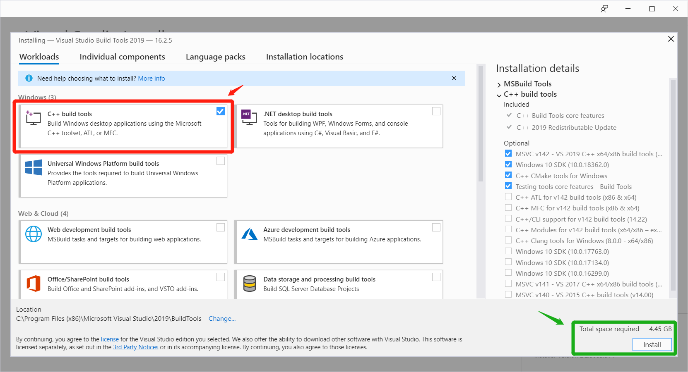
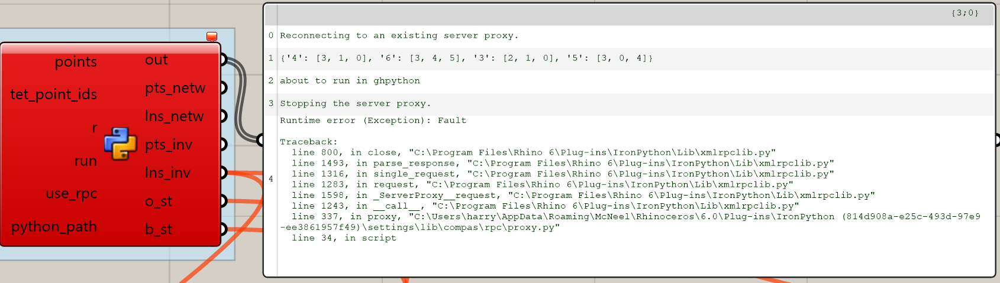

Troubleshooting
================

Sometimes things don't go as expected. Here are some of answers to the most common issues you might bump into:

------------

..

    Q: Error: Microsoft Visual C++ 14.0 is required

.. _vc14_instruction:

1. Follow the `link <https://visualstudio.microsoft.com/thank-you-downloading-visual-studio/?sku=BuildTools&rel=16>`_
   to download the visual studio build tools.
2. Click the ``vs_buildtools__xxx.exe`` file you just downloaded.
3. Follow the instruction of the Visual Studio Installer, until it
   finishes its downloading and installation.
4. Select ``C++ Build Tools`` and click ``Install``.

------------

..

    Q: I've installed ``git`` but ``git`` commands don't work in the commandline prompt.

See `this post <https://stackoverflow.com/a/53706956>`_ for instructions on
how to add ``git`` to the environment PATH in Windows.

------------

..

    Q: `conda` commands don't work.

Try running them from the *Conda Prompt*. Depending on how you installed Anaconda, it might not be available by default on the normal Windows command prompt.

------------

..

    Q: When trying to install the framework in Rhino, it fails indicating the lib folder of IronPython does not exist.

Make sure you have opened Rhino 6 and Grasshopper at least once, so that it finishes setting up all its internal folder structure.

------------

..

    Q: Windows error in the Grasshopper rpc call.

Make sure you enter the correct python path in the GH file. An easy way to obtain
the path is to type ``where python`` in your conda prompt after you activate ``coop_assembly_ws``.

.. image:: images/windows_error.png
   :scale: 50 %
   :alt: GH windows error
   :align: center

------------

..

    Q: Runtime error: Fault in the Grasshopper rpc call.

Try the following:

1. If you have V-Ray installed, uninstall V-Ray for Rhinoceros and
   restart your computer.
2. If the problem persists after retrying, first open your Task Manager and
   end all ``Python`` processes.

   Then in your activated conda environment, run:

    ::

        cd docs/gh_example_instructions
        python rpc_test.py

    It should print the following:

    ::

        Starting a new proxy server...
        New proxy server started.

    Then, retry opening the Grasshopper file.

------------

..

    Q: In Xfunc call, error message "Cannot find DLL specified. (_Arpack ...)"

This happens because some previous calls blocked the ``scipy`` complied libraries.
For a temporal fix, in your conda environment, uninstall ``pip install scipy`` and
then ``pip install scipy=1.3.1`` works.

Updating packages
-----------------

Updating the conda environment
^^^^^^^^^^^^^^^^^^^^^^^^^^^^^^

If you've installed the environment following the instructions above,
but want to update the env (e.g. if the ``yml`` file is updated),
run the following command to update:

::

    conda env update -n coop_assembly_ws -f coop_assembly_ws.yml

Updating individual packages
^^^^^^^^^^^^^^^^^^^^^^^^^^^^

Updating only some of the dependencies? Here are some convenient links
(remember to activate your conda environment by ``conda activate coop_assembly_ws``
before you do these!):

Update ``coop_assembly``:

::

    pip install --upgrade git+https://github.com/createchaos/coop_assembly.git@master#egg=coop_assembly
    python -m compas_rhino.install -p coop_assembly

Update ``pychoreo``:

::

    pip install --upgrade git+https://github.com/yijiangh/pychoreo.git@feature/compas_fab-integration#egg=pychoreo

Update ``compas_fab``:

::

    pip install --upgrade git+https://github.com/yijiangh/compas_fab.git@feature/dms2019_ws#egg=compas_fab
    python -m compas_rhino.install -p compas_fab
